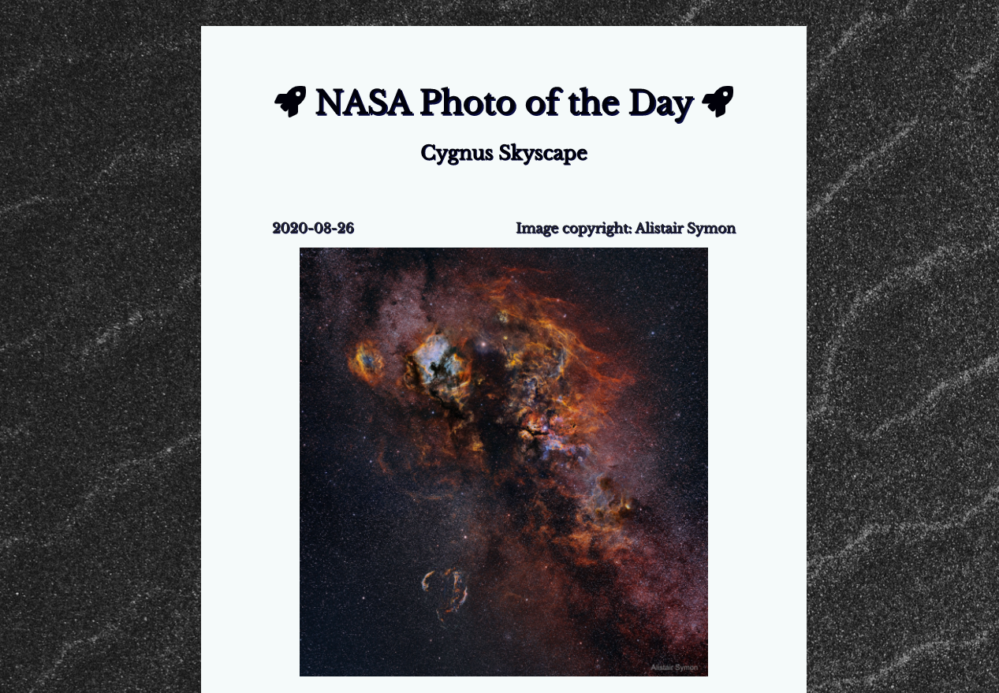

# NASA Photo of the Day

## Description

NASA Photo of the Day is a responsive application on which you can see NASA's “astronomy picture of the day”, and read the accompanying metadata (title, description, copyright information). I initially built this project in 2 days by myself, as a means of practicing both my Javascript and React skills. More specifically, I was targeting my emerging ability to work with [an external API](https://api.nasa.gov/).

Ten months later, I returned to the project to update the styling (including experimenting with CSS animation), simplify the code itself, and, most notably, extend it by adding an additional feature. The application now allows for the user to select another date, which makes an additional API call and retrieves new data, thus allowing the user full access to the API’s entire catalogue of images.

Here's the [deployed site](https://nasa-photo-of-the-day-sage.vercel.app/).

## Tech Stack 
### ReactJS
* Declarative
* Component Based
* Renders proper Html using JSX
* Lightweight and has a very small API surface

### Moment
* Used to parse, validate, manipulate, and display dates and times in JavaScript

### CSS
* Used for basic styling 